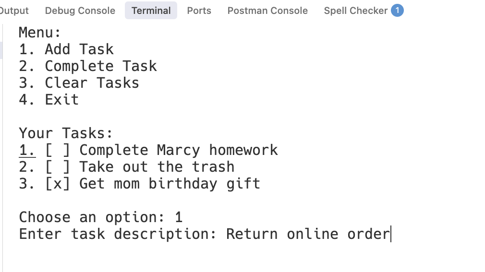

# Project Overview

This project is a simple command-line task manager where users can add, view, and complete tasks. The application stores tasks in an array of objects, gives users options through prompts, and uses array iteration and array methods to handle interactions with tasks.

## Key Features & Usage Example
After running the application, the user is presented with a menu of options. They can:
1. Add a new task to their list of tasks
2. Mark a task as completed
3. Delete all tasks from the list
4. Exit the application.

In the screenshot below, you can see a user selecting the "Add Task" option and entering a task description "Return online order".



## Setup

Follow these steps to get started:

```sh
# Clone the repo
git clone git@github.com:The-Marcy-Lab-School/swe-casestudy-1-cli-task-manager.git

# Install dependencies
cd swe-casestudy-1-cli-task-manager.git
npm install

# Run the src/index.js file
npm start
```

## Key Technologies & Packages

* Node
* `prompt-sync`